# Entity-Relationship Reference

Authoritative reference for the schema defined in `apps/api/src/db/schema/`.
The diagram below is abbreviated for readability; the field tables that follow
it are the source of truth for every column, type, and constraint. See
[ARCHITECTURE.md](./ARCHITECTURE.md#multi-tenancy-model) for why the model is
shaped this way.

## Diagram

```mermaid
erDiagram
    BUSINESSES ||--o{ BRANCHES : "has"
    BUSINESSES ||--o{ ROLES : "owns"
    BUSINESSES ||--o{ USER_BUSINESS_ROLES : "scopes"
    BUSINESSES ||--o{ AUDIT_LOG : "scopes (nullable, SET NULL)"
    BRANCHES ||--o{ USER_BUSINESS_ROLES : "scopes (nullable)"
    USERS ||--o{ USER_BUSINESS_ROLES : "holds"
    USERS ||--o{ AUDIT_LOG : "acts as (nullable, SET NULL)"
    USERS ||--o{ REFRESH_TOKENS : "owns"
    ROLES ||--o{ USER_BUSINESS_ROLES : "grants"
    ROLES ||--o{ ROLE_PERMISSIONS : "includes"
    PERMISSIONS ||--o{ ROLE_PERMISSIONS : "included in"
    BUSINESSES ||--o{ QR_CODES : "has"
    BRANCHES ||--o{ QR_CODES : "has"
    BUSINESSES ||--o{ FEEDBACK : "has"
    BRANCHES ||--o{ FEEDBACK : "has"
    QR_CODES ||--o{ FEEDBACK : "source of"
    BUSINESSES ||--o{ LOYALTY_TIERS : "defines"
    BUSINESSES ||--o{ LOYALTY_REWARDS : "defines"
    BUSINESSES ||--o{ LOYALTY_ACCOUNTS : "has members"
    BUSINESSES ||--o{ LOYALTY_SETTINGS : "configures (1:1)"
    CUSTOMERS ||--o{ LOYALTY_ACCOUNTS : "holds"
    CUSTOMERS ||--o{ LOYALTY_ACCOUNTS : "referred (nullable, SET NULL)"
    LOYALTY_TIERS ||--o{ LOYALTY_ACCOUNTS : "assigned to (nullable)"
    LOYALTY_ACCOUNTS ||--o{ LOYALTY_TRANSACTIONS : "ledger"
    LOYALTY_REWARDS ||--o{ LOYALTY_TRANSACTIONS : "redeemed (nullable)"
    QR_CODES ||--o{ LOYALTY_TRANSACTIONS : "check-in source (nullable)"
    BUSINESSES ||--o{ NOTIFICATION_PREFERENCES : "scopes"
    USERS ||--o{ NOTIFICATION_PREFERENCES : "sets (nullable)"
    CUSTOMERS ||--o{ NOTIFICATION_PREFERENCES : "sets (nullable)"
    BUSINESSES ||--o{ NOTIFICATIONS : "sends"
    USERS ||--o{ NOTIFICATIONS : "recipient (nullable, SET NULL)"
    CUSTOMERS ||--o{ NOTIFICATIONS : "recipient (nullable, SET NULL)"
    BUSINESSES ||--o{ BUSINESS_NOTIFICATION_SETTINGS : "configures (1:1)"
    BUSINESSES ||--o{ BUSINESS_SUBSCRIPTIONS : "subscribes (1:1)"
    SUBSCRIPTION_PLANS ||--o{ BUSINESS_SUBSCRIPTIONS : "defines"

    BUSINESSES {
        uuid id PK
        text name
        text slug UK
        text status
    }
    BRANCHES {
        uuid id PK
        uuid business_id FK
        text name
        text slug
        text status
    }
    USERS {
        uuid id PK
        text email UK
        text password_hash
        text status
    }
    ROLES {
        uuid id PK
        uuid business_id FK
        text name
        boolean is_system
    }
    PERMISSIONS {
        uuid id PK
        text key UK
        text category
    }
    ROLE_PERMISSIONS {
        uuid role_id PK_FK
        uuid permission_id PK_FK
    }
    USER_BUSINESS_ROLES {
        uuid id PK
        uuid user_id FK
        uuid business_id FK
        uuid branch_id FK
        uuid role_id FK
    }
    AUDIT_LOG {
        uuid id PK
        uuid business_id FK
        uuid actor_user_id FK
        text action
        text entity_type
    }
    REFRESH_TOKENS {
        uuid id PK
        uuid user_id FK
        text token_hash
        timestamptz expires_at
    }
    QR_CODES {
        uuid id PK
        uuid business_id FK
        uuid branch_id FK
        text token UK
        text type
        text status
    }
    FEEDBACK {
        uuid id PK
        uuid business_id FK
        uuid branch_id FK
        uuid qr_code_id FK
        integer rating
        text status
    }
    CUSTOMERS {
        uuid id PK
        text phone UK
        timestamptz phone_verified_at
        text status
    }
    OTP_CODES {
        uuid id PK
        text phone
        text code_hash
        integer attempts
        timestamptz expires_at
    }
    LOYALTY_TIERS {
        uuid id PK
        uuid business_id FK
        text name
        integer min_points
    }
    LOYALTY_REWARDS {
        uuid id PK
        uuid business_id FK
        text name
        integer points_cost
        text status
    }
    LOYALTY_ACCOUNTS {
        uuid id PK
        uuid customer_id FK
        uuid business_id FK
        uuid tier_id FK
        integer points
        integer visit_count
    }
    LOYALTY_TRANSACTIONS {
        uuid id PK
        uuid loyalty_account_id FK
        text type
        integer points
        text redemption_code UK
    }
    LOYALTY_SETTINGS {
        uuid id PK
        uuid business_id FK
        integer points_per_checkin
        numeric points_per_currency_unit
    }
    NOTIFICATION_PREFERENCES {
        uuid id PK
        uuid business_id FK
        uuid user_id FK
        uuid customer_id FK
        text event_type
        text channel
        boolean enabled
    }
    NOTIFICATIONS {
        uuid id PK
        uuid business_id FK
        uuid user_id FK
        uuid customer_id FK
        text event_type
        text channel
        text status
    }
    BUSINESS_NOTIFICATION_SETTINGS {
        uuid id PK
        uuid business_id FK
        boolean email_enabled
        boolean sms_enabled
        integer max_sms_per_day
    }
    SUBSCRIPTION_PLANS {
        uuid id PK
        text key UK
        text name
        boolean is_active
        boolean is_default_trial
    }
    BUSINESS_SUBSCRIPTIONS {
        uuid id PK
        uuid business_id FK
        uuid plan_id FK
        text status
        text stripe_customer_id
    }
```

## Design Conventions

These apply across every table unless a table's own notes say otherwise.

- **UUIDs everywhere**, generated by Postgres (`defaultRandom()`), never
  auto-increment integers — safe to generate client-side later, no
  cross-shard collision risk, doesn't leak row counts.
- **Audit columns** (`created_at`, `created_by`, `updated_at`, `updated_by`) are
  spread from `_shared.ts`'s `auditColumns` into every tenant-owned,
  user-mutable table. `created_by`/`updated_by` are plain UUIDs with **no FK
  constraint** to `users` — a real FK would force `users` to self-reference and
  couple every table's migration order to `users` existing first; referential
  correctness here is enforced at the repository layer instead.
- **Soft delete** (`is_deleted`, `deleted_at`, `deleted_by`) via `_shared.ts`'s
  `softDeleteColumns`, spread into the same tables as `auditColumns` *except*
  `permissions`, `role_permissions`, and `audit_log`, which opt out on purpose
  (see their individual notes below). Repositories never return soft-deleted
  rows by default.
- **Cascade by default**: every foreign key cascades on delete *except*
  `audit_log.business_id` and `audit_log.actor_user_id`, which use
  `ON DELETE SET NULL` so the audit trail outlives a purged business or user.
- **Timestamps are `timestamptz`** (timezone-aware) throughout — never a bare
  `timestamp` — required for a platform spanning multiple IANA timezones.

## Tables

### `businesses`

The tenant. Every other tenant-owned table hangs off `business_id`, directly or
(for branch-scoped data) via `branches.business_id`.

| Column | Type | Constraints | Notes |
| --- | --- | --- | --- |
| `id` | uuid | PK, default random | |
| `name` | text | not null | |
| `slug` | text | not null, unique | URL-safe identifier |
| `legal_name` | text | nullable | |
| `industry` | text | nullable | |
| `default_locale` | text | not null, default `'en'`, check | `en \| es \| fr` — closed enum (`businesses_default_locale_check`), not open BCP-47; drives both Intl formatting and UI string lookup, so an untranslated tag would silently half-localize a business (i18n & Multi-Currency module). Also enforced at the Zod layer (`localeSchema`) before a request ever reaches this constraint |
| `default_currency` | text | not null, default `'USD'` | ISO 4217 |
| `default_timezone` | text | not null, default `'UTC'` | IANA timezone |
| `status` | text | not null, default `'active'`, check | `active \| suspended \| archived` |
| + audit columns | | | |
| + soft-delete columns | | | |

### `branches`

A physical or logical location belonging to a business. QR codes, feedback, and
loyalty check-ins are always scoped to a branch.

| Column | Type | Constraints | Notes |
| --- | --- | --- | --- |
| `id` | uuid | PK, default random | |
| `business_id` | uuid | not null, FK → `businesses.id`, cascade | |
| `name` | text | not null | |
| `slug` | text | not null | unique per business, not globally |
| `address_line1/2`, `city`, `state_province`, `postal_code` | text | nullable | |
| `country_code` | text | nullable | ISO 3166-1 alpha-2 |
| `timezone` | text | not null, default `'UTC'` | IANA timezone, overrides business default |
| `latitude`, `longitude` | double precision | nullable | |
| `status` | text | not null, default `'active'`, check | `active \| inactive \| archived` |
| + audit columns | | | |
| + soft-delete columns | | | |

**Indexes**: unique on `(business_id, slug)`.

### `users`

A platform user with dashboard access (owner, manager, staff) — **not** a
customer/loyalty member; that is a separate future concern. A user's businesses
and permissions come entirely from `user_business_roles`, never a column here.

| Column | Type | Constraints | Notes |
| --- | --- | --- | --- |
| `id` | uuid | PK, default random | |
| `email` | text | not null, unique | globally unique across the platform |
| `email_verified_at` | timestamptz | nullable | |
| `password_hash` | text | not null | PBKDF2 self-describing format, see ARCHITECTURE.md |
| `full_name` | text | not null | |
| `phone` | text | nullable | |
| `status` | text | not null, default `'invited'`, check | `invited \| active \| suspended \| deactivated` |
| `last_login_at` | timestamptz | nullable | |
| `platform_role` | text | nullable, check | `support \| billing \| admin` — Platform Admin Console (Block 1); NULL for the overwhelming majority of rows. Layered on top of, never a replacement for, `user_business_roles` — see ARCHITECTURE.md's Multi-Tenancy Model. Deliberately not in `packages/shared-types` |
| + audit columns | | | |
| + soft-delete columns | | | |

### `roles`

A named permission bundle, always owned by exactly one business — no
shared/global rows. New businesses get four starter roles seeded at creation
(Owner, Admin, Manager, Staff); businesses can rename, delete, or add to their
own copies freely.

| Column | Type | Constraints | Notes |
| --- | --- | --- | --- |
| `id` | uuid | PK, default random | |
| `business_id` | uuid | not null, FK → `businesses.id`, cascade | |
| `name` | text | not null | |
| `description` | text | nullable | |
| `is_system` | boolean | not null, default `false` | `true` for the 4 seeded starter roles |
| + audit columns | | | |
| + soft-delete columns | | | |

**Indexes**: unique on `(business_id, name)`.

### `permissions`

Global, platform-defined capability catalog — **not** tenant-scoped. Seeded by
`pnpm db:seed` (`src/db/seed/permissions.seed.ts`) as features ship; never
created ad hoc by a business or the API. 20 keys today across 9 categories
(Business, Branches, Team, Roles, Audit, Feedback, Loyalty, Analytics,
Notifications) — full list in [API.md](./API.md#permissions-catalog). *(This
line was found stale at "16 keys / 7 categories" while documenting the
Notifications module — it was never updated when AI Sentiment Analytics
added the Analytics category two modules ago. Fixed here for both at once;
see [ARCHITECTURE.md](./ARCHITECTURE.md#risks--known-gaps) for the same class
of drift found and fixed in the Multi-Tenancy Model section.)*

| Column | Type | Constraints | Notes |
| --- | --- | --- | --- |
| `id` | uuid | PK, default random | |
| `key` | text | not null, unique | e.g. `"team:invite"`, `resource:action` convention |
| `description` | text | not null | |
| `category` | text | not null | groups permissions for UI display |
| `created_at`, `updated_at` | timestamptz | not null, default now | no audit/soft-delete columns — global catalog, not tenant-mutable |

### `role_permissions`

Pure many-to-many join: which permissions a role grants.

| Column | Type | Constraints | Notes |
| --- | --- | --- | --- |
| `role_id` | uuid | PK (composite), FK → `roles.id`, cascade | |
| `permission_id` | uuid | PK (composite), FK → `permissions.id`, cascade | |
| `created_at` | timestamptz | not null, default now | no soft delete — membership is binary |

### `user_business_roles`

Grants a role to a user at a business, either business-wide (`branch_id` NULL)
or scoped to one branch. **This — not a column on `users` — is the source of
truth** for "which businesses does this user belong to" and "what can they do."
Revocation is a soft delete so access history survives for compliance review.

| Column | Type | Constraints | Notes |
| --- | --- | --- | --- |
| `id` | uuid | PK, default random | |
| `user_id` | uuid | not null, FK → `users.id`, cascade | |
| `business_id` | uuid | not null, FK → `businesses.id`, cascade | |
| `branch_id` | uuid | nullable, FK → `branches.id`, cascade | NULL = business-wide grant |
| `role_id` | uuid | not null, FK → `roles.id`, cascade | |
| `created_at`, `created_by` | | | no `updated_at` — grants are revoked, not edited |
| `deleted_at`, `deleted_by` | | | soft delete = revocation |

**Indexes**: `user_id`; `business_id`; two **partial** unique indexes —
`(user_id, business_id, branch_id, role_id) WHERE branch_id IS NOT NULL` and
`(user_id, business_id, role_id) WHERE branch_id IS NULL`. Two partial indexes
instead of one composite unique constraint because Postgres treats every NULL
as distinct, so a plain composite unique would silently allow duplicate
business-wide grants for the same user/business/role.

### `audit_log`

Append-only audit trail, auto-populated by global middleware
(`src/middleware/audit.ts`) for every successful mutating request. No
`updated_at`/soft-delete — rows are never modified after insert.

| Column | Type | Constraints | Notes |
| --- | --- | --- | --- |
| `id` | uuid | PK, default random | |
| `business_id` | uuid | nullable, FK → `businesses.id`, **SET NULL** | |
| `actor_user_id` | uuid | nullable, FK → `users.id`, **SET NULL** | |
| `action` | text | not null | namespaced, e.g. `"business.created"` |
| `entity_type` | text | not null | |
| `entity_id` | uuid | nullable | |
| `metadata` | jsonb | nullable | route-supplied detail, see `auditMetadata` context var |
| `ip_address`, `user_agent` | text | nullable | from `cf-connecting-ip` / request header |
| `created_at` | timestamptz | not null, default now | |

**Indexes**: `(business_id, created_at)`, `(entity_type, entity_id)`,
`(actor_user_id, created_at)` — all composite, matching the query patterns the
audit-log API endpoint uses (recent-first, per-business or per-entity lookup).

### `refresh_tokens`

One row per issued refresh token, hashed at rest (SHA-256, never stored raw).
Rotation on every `/auth/refresh` call marks the old row revoked
(`replaced_by_token_id` chains to the new one) rather than deleting it, so a
stolen-and-replayed old token is detectable.

| Column | Type | Constraints | Notes |
| --- | --- | --- | --- |
| `id` | uuid | PK, default random | embedded as the JWT's `jti` claim |
| `user_id` | uuid | not null, FK → `users.id`, cascade | |
| `token_hash` | text | not null | SHA-256, not PBKDF2 — high-entropy input, no brute-force risk |
| `issued_at`, `expires_at` | timestamptz | not null | 30-day TTL |
| `revoked_at` | timestamptz | nullable | set on rotation or logout |
| `replaced_by_token_id` | uuid | nullable, **no FK** | trail marker only, consistent with `_shared.ts` audit-pointer convention |
| `user_agent`, `ip_address` | text | nullable | captured at issuance |

**Indexes**: `user_id`.

### `qr_codes`

Added in QR Engagement Block 1. A scannable public entry point into one
branch's feedback flow. No server-side QR *image* is generated or stored
anywhere — this row is just an opaque token; the scannable image renders
client-side (`apps/web`, QR Engagement Block 4) from a `<origin>/feedback/<token>`
URL built at render time.

| Column | Type | Constraints | Notes |
| --- | --- | --- | --- |
| `id` | uuid | PK, default random | |
| `business_id` | uuid | not null, FK → `businesses.id`, cascade | |
| `branch_id` | uuid | not null, FK → `branches.id`, cascade | |
| `token` | text | not null, unique | deliberately separate from `id` — shorter, scans more reliably, and regenerating never touches the branch's real id or its FK references |
| `type` | text | not null, default `'feedback'` | no CHECK constraint — future values (loyalty check-in, promotions) aren't designed yet, unlike `status` below |
| `status` | text | not null, default `'active'`, check | `active \| revoked` |
| + audit columns | | | |
| + soft-delete columns | | | `status='revoked'` (not soft delete) is how a regenerated code stops resolving — it stays fully queryable for history |

**Indexes**: partial unique on `(branch_id, type) WHERE status = 'active'` —
at most one active code per branch per type, enforced at the database level
(same pattern as `user_business_roles`' partial indexes), not just by
`QrCodeService`'s application-level check-then-create logic.

### `feedback`

Added in QR Engagement Block 1. A single customer-submitted rating/comment,
captured anonymously through the public `POST /qr/:token/feedback` endpoint —
no `users` row exists for the customer, so `created_by` stays `NULL` for
every row here, the same way `audit_log` handles "no authenticated actor"
for signup/login.

| Column | Type | Constraints | Notes |
| --- | --- | --- | --- |
| `id` | uuid | PK, default random | |
| `business_id` | uuid | not null, FK → `businesses.id`, cascade | |
| `branch_id` | uuid | not null, FK → `branches.id`, cascade | |
| `qr_code_id` | uuid | not null, FK → `qr_codes.id`, cascade | every submission today arrives via a QR scan — no other intake channel exists or is designed |
| `rating` | integer | not null, check | 1-5 |
| `comment` | text | nullable | |
| `customer_name`, `customer_email`, `customer_phone` | text | nullable | all optional — a contact-info wall in front of a star rating would defeat the point of a frictionless QR flow |
| `status` | text | not null, default `'new'`, check | `new \| reviewed` — business-meaningful triage state, distinct from soft delete |
| + audit columns | | | `created_by` always `NULL` (anonymous submission) |
| + soft-delete columns | | | |

All three FKs **cascade** on delete, deliberately **not** `audit_log`'s `SET
NULL` pattern — feedback is normal tenant business data (purged with its
business), not an immutable compliance trail; `audit_log` is the schema's
one deliberate exception to cascade-by-default, not a template for every
table that stores historical data.

**Indexes**: `(branch_id, created_at)`, `(business_id, created_at)` —
composite, matching the recent-first, optionally per-branch query pattern
`GET /feedback` uses.

### `customers`

Added in Digital Loyalty Block 1. A **GLOBAL** customer identity, mirroring
how `users` (staff) is global — one row per phone number across the *whole
platform*, never per-business. `loyalty_accounts` (below) carries the
business-scoped membership, the same global-identity/business-scoped-grant
split `users`/`user_business_roles` already establishes. A customer scanning
a QR code at a second, unrelated business never re-verifies their phone.
Never a `users` row — customers have no staff-style login or RBAC; identity
comes from SMS OTP (`apps/api/src/customer-auth/`), not a password.

| Column | Type | Constraints | Notes |
| --- | --- | --- | --- |
| `id` | uuid | PK, default random | |
| `phone` | text | not null, unique | E.164 format |
| `full_name`, `email` | text | nullable | |
| `birthday` | date | nullable | month/day matter most (birthday rewards); year optional in the UI |
| `phone_verified_at` | timestamptz | nullable | set on first successful OTP verify |
| `status` | text | not null, default `'active'`, check | `active \| suspended` |
| + audit columns | | | |
| + soft-delete columns | | | |

### `otp_codes`

Added in Digital Loyalty Block 1. Ephemeral SMS verification artifacts —
deliberately **no** audit/soft-delete columns, same reasoning as
`refresh_tokens`: a short-lived security artifact, not tenant-owned business
data. **No FK to `customers.id`** — a phone's first-ever OTP request happens
before any `customers` row exists, so the relationship would be circular.

| Column | Type | Constraints | Notes |
| --- | --- | --- | --- |
| `id` | uuid | PK, default random | |
| `phone` | text | not null, no FK | |
| `code_hash` | text | not null | same self-describing PBKDF2 format as password hashes, but far fewer iterations (10k vs 600k) — OTP security comes from the short `expires_at` window and `attempts` capping below, not offline-hash resistance |
| `expires_at` | timestamptz | not null | 10-minute TTL |
| `attempts` | integer | not null, default 0 | capped at 5 by `CustomerAuthService`, not a DB constraint |
| `consumed_at` | timestamptz | nullable | set once successfully verified — a code is single-use |
| `created_at` | timestamptz | not null, default now | |

### `loyalty_tiers`

Added in Digital Loyalty Block 1. A business-defined points threshold
(Silver, Gold, ...) a `loyalty_accounts` row unlocks automatically once its
balance crosses `min_points`.

| Column | Type | Constraints | Notes |
| --- | --- | --- | --- |
| `id` | uuid | PK, default random | |
| `business_id` | uuid | not null, FK → `businesses.id`, cascade | |
| `name` | text | not null | |
| `min_points` | integer | not null | |
| `benefits` | text | nullable | plain descriptive text, not a structured rules engine — no automated benefit-application mechanism exists |
| `sort_order` | integer | not null, default 0 | |
| + audit columns | | | |
| + soft-delete columns | | | |

**Indexes**: unique on `(business_id, name)`.

### `loyalty_rewards`

Added in Digital Loyalty Block 1. A redeemable catalog item.

| Column | Type | Constraints | Notes |
| --- | --- | --- | --- |
| `id` | uuid | PK, default random | |
| `business_id` | uuid | not null, FK → `businesses.id`, cascade | |
| `name` | text | not null | |
| `description` | text | nullable | |
| `points_cost` | integer | not null, check | `> 0` |
| `status` | text | not null, default `'active'`, check | `active \| inactive` — status, not soft-delete, so a retired reward's historical redemptions (`loyalty_transactions.related_reward_id`) stay intact and readable |
| + audit columns | | | |
| + soft-delete columns | | | |

### `loyalty_accounts`

Added in Digital Loyalty Block 1. The business-scoped membership half of the
`customers`/`loyalty_accounts` split — one row per (customer, business) pair,
mirroring `user_business_roles`' role. `points` is a **denormalized running
total**, maintained transactionally alongside every `loyalty_transactions`
insert (`LoyaltyAccountService`, never a raw `UPDATE` from a route).

| Column | Type | Constraints | Notes |
| --- | --- | --- | --- |
| `id` | uuid | PK, default random | |
| `customer_id` | uuid | not null, FK → `customers.id`, cascade | |
| `business_id` | uuid | not null, FK → `businesses.id`, cascade | |
| `points` | integer | not null, default 0, check | `>= 0` |
| `tier_id` | uuid | nullable, FK → `loyalty_tiers.id`, **SET NULL** | recalculated automatically after every earning transaction |
| `referred_by_customer_id` | uuid | nullable, FK → `customers.id`, **SET NULL** | business-scoped referral tracking even though identity is global — the referral *reward* is business-scoped |
| `visit_count` | integer | not null, default 0 | |
| `last_visit_at` | timestamptz | nullable | bumped only by `type='checkin'` transactions, not purchases |
| `status` | text | not null, default `'active'`, check | `active \| suspended` |
| + audit columns | | | |
| + soft-delete columns | | | |

**Indexes**: unique on `(customer_id, business_id)` — one account per
customer per business, enforced at the database level, mirroring
`user_business_roles`' partial-unique pattern (this one is a plain composite
unique, not partial, since there's no nullable column in the key).

### `loyalty_transactions`

Added in Digital Loyalty Block 1. Append-only points ledger, mirroring
`audit_log`'s design — the source of truth behind
`loyalty_accounts.points`'s denormalized total. `type` **does** get a CHECK
constraint (unlike `qr_codes.type`) because every earning/spending mechanism
this module supports is fully designed now, not speculative.

| Column | Type | Constraints | Notes |
| --- | --- | --- | --- |
| `id` | uuid | PK, default random | |
| `loyalty_account_id` | uuid | not null, FK → `loyalty_accounts.id`, cascade | |
| `type` | text | not null, check | `checkin \| purchase \| redemption \| referral_bonus \| birthday_bonus \| adjustment` |
| `points` | integer | not null | positive = earned, negative = redeemed/adjusted down |
| `related_reward_id` | uuid | nullable, FK → `loyalty_rewards.id`, **SET NULL** | set only for `type='redemption'` |
| `related_qr_code_id` | uuid | nullable, FK → `qr_codes.id`, **SET NULL** | set only for `type='checkin'` |
| `purchase_amount` | numeric(10,2) | nullable | set only for `type='purchase'` |
| `redemption_code` | text | nullable, unique | set only for `type='redemption'` — 8-char human-typeable code, distinct alphabet from OTP codes (visually-unambiguous letters+digits, no `0/O/1/I/L`) |
| `redemption_confirmed_at` | timestamptz | nullable | the **one** deliberate exception to append-only: a single one-way `UPDATE` when staff confirms a redemption at the counter, mirroring `feedback.status`'s `new`→`reviewed` transition |
| `notes` | text | nullable | free-text, e.g. for manual `adjustment` entries |
| `created_at`, `created_by` | | | `created_by` is the staff actor for purchase/adjustment/redemption-confirm, `NULL` for customer-initiated checkin/redemption-request |

No soft-delete columns — a ledger entry is never removed, same as `audit_log`.

**Indexes**: `(loyalty_account_id, created_at)`; partial unique on
`redemption_code WHERE redemption_code IS NOT NULL`.

### `loyalty_settings`

Added in Digital Loyalty Block 3 (not Block 1) — only became clear the
points engine needed configurable earning rates once actually writing the
earning logic. One row per business (lazily created with defaults on first
read, `LoyaltySettingsRepository.getOrCreateDefaults`), never a hard-coded
constant — a fixed "10 points per check-in" would violate this schema's
"never hard-code limits" convention the moment two businesses want different
rates.

| Column | Type | Constraints | Notes |
| --- | --- | --- | --- |
| `id` | uuid | PK, default random | |
| `business_id` | uuid | not null, FK → `businesses.id`, cascade | |
| `points_per_checkin` | integer | not null, default 10, check | `>= 0` |
| `points_per_currency_unit` | numeric(6,2) | not null, default `'1.00'`, check | `>= 0` — points earned per whole currency unit spent |
| `referral_bonus_points` | integer | not null, default 50, check | `>= 0` |
| `birthday_bonus_points` | integer | not null, default 100, check | `>= 0` — configurable, but nothing schedules/awards it yet, see API.md's "Not Yet Implemented" |
| + audit columns | | | no soft-delete — deleted alongside its business via cascade, never independently "removed" |

**Indexes**: unique on `business_id`.

### `notification_preferences`

Added in Notifications Block 1. One row per (recipient, business, eventType,
channel) the recipient has explicitly overridden — an absent row means
"enabled" (this module's events are entirely transactional, not promotional,
so opt-out rather than opt-in is the sensible default). `business_id` is
NOT NULL even on customer-owned rows, since preferences are business-scoped
(a customer's preferences at one business are independent of their
preferences at another) even though `customers` itself is a global identity.

| Column | Type | Constraints | Notes |
| --- | --- | --- | --- |
| `id` | uuid | PK, default random | |
| `business_id` | uuid | not null, FK → `businesses.id`, cascade | |
| `user_id` | uuid | nullable, FK → `users.id`, cascade | exactly one of `user_id`/`customer_id` set, enforced by CHECK |
| `customer_id` | uuid | nullable, FK → `customers.id`, cascade | see above |
| `event_type` | text | not null, check | `feedback_received \| summary_ready \| redemption_pending \| points_earned \| tier_upgraded \| reward_redeemed` |
| `channel` | text | not null, check | `email \| sms \| push` — `push` enumerated for forward-compatibility; no delivery implementation exists yet |
| `enabled` | boolean | not null, default `true` | opt-out model, see above |
| + audit columns | | | |

**Constraints**: CHECK `(user_id IS NULL) <> (customer_id IS NULL)` —
exactly one recipient identity set.

**Indexes**: `user_id`; `customer_id`; **two** partial unique indexes —
`(business_id, user_id, event_type, channel) WHERE user_id IS NOT NULL` and
`(business_id, customer_id, event_type, channel) WHERE customer_id IS NOT NULL`.
Two partial indexes instead of one combined index for the same reason
`user_business_roles` uses two: Postgres treats every NULL as distinct, so a
single index spanning both nullable columns would silently allow duplicate
rows on whichever side happens to be null for a given row.

### `notifications`

Added in Notifications Block 1. Append-only send log, mirroring
`audit_log`/`loyalty_transactions` — every *attempted* notification, not
just successful ones. `recipient_address` **snapshots** the actual
email/phone at send time rather than joining live to `users`/`customers`,
so a log entry stays accurate (and legible for support) even after a
recipient later changes their contact info.

| Column | Type | Constraints | Notes |
| --- | --- | --- | --- |
| `id` | uuid | PK, default random | |
| `business_id` | uuid | not null, FK → `businesses.id`, cascade | |
| `user_id` | uuid | nullable, FK → `users.id`, **SET NULL** | |
| `customer_id` | uuid | nullable, FK → `customers.id`, **SET NULL** | recipient identity, informational only once sent — SET NULL (not cascade) so the log survives a deleted account, same reasoning as `audit_log.actor_user_id` |
| `event_type` | text | not null, check | same 6 values as `notification_preferences.event_type` |
| `channel` | text | not null, check | `email \| sms \| push` |
| `recipient_address` | text | not null | snapshotted email/phone, see above |
| `subject` | text | nullable | email only — SMS has no subject line |
| `body` | text | not null | rendered content actually sent |
| `status` | text | not null, default `'pending'`, check | `pending \| sent \| failed` |
| `sent_at` | timestamptz | nullable | set on successful delivery |
| `created_at` | timestamptz | not null, default now | no `updated_at`/soft-delete — append-only; only `status`/`sent_at` ever transition, via `markSent`/`markFailed`, never a generic update |

**Indexes**: `user_id`; `customer_id`; `(business_id, created_at)` — backs
the send-log listing; `(business_id, channel, created_at)` — backs the daily
SMS cap COUNT query (`NotificationRepository.countSince`).

### `business_notification_settings`

Added in Notifications Block 1. One row per business (lazily created with
defaults on first read, mirrors `loyalty_settings`'s
`getOrCreateDefaults` pattern). Exists specifically as a cost/abuse control:
public unauthenticated feedback submission can trigger an SMS via
`feedback_received`, so `max_sms_per_day` is a real safety cap, not a
theoretical one.

| Column | Type | Constraints | Notes |
| --- | --- | --- | --- |
| `id` | uuid | PK, default random | |
| `business_id` | uuid | not null, FK → `businesses.id`, cascade | |
| `email_enabled` | boolean | not null, default `true` | platform-wide kill switch |
| `sms_enabled` | boolean | not null, default `true` | platform-wide kill switch |
| `max_sms_per_day` | integer | not null, default 50, check | `>= 0` — `0` is a valid, meaningful value (hard-stop SMS without flipping `sms_enabled`) |
| + audit columns | | | no soft-delete — like `loyalty_settings`, this row is deleted alongside its business via cascade, never independently "removed" |

**Indexes**: unique on `business_id`.

### `subscription_plans`

Added in Platform Admin Console Block 8. Platform-defined SaaS pricing
catalog — what a business pays Echo Grid Feedback to use the platform, not to be
confused with `loyalty_rewards`/`loyalty_tiers` (a business's own program for
its customers). Global, not tenant-owned, the same shape as `permissions`:
rows are managed by platform admins (`billing`/`admin` `platformRole`), never
created by a business itself. Never hard-deleted — `is_active = false`
retires a plan from the picker while keeping it resolvable for existing
(grandfathered) subscribers, the same "archived, not deleted" convention
`businesses.status` already uses.

| Column | Type | Constraints | Notes |
| --- | --- | --- | --- |
| `id` | uuid | PK, default random | |
| `key` | text | not null, unique | stable identifier independent of the display name, e.g. `growth` |
| `name` | text | not null | display name |
| `description` | text | nullable | |
| `price_monthly_cents` | integer | not null, check `>= 0` | integer cents, same minor-unit convention Stripe itself uses |
| `price_yearly_cents` | integer | nullable, check `>= 0` | |
| `currency` | text | not null, default `'usd'` | lowercase ISO 4217 — matches Stripe's own convention, unlike `businesses.default_currency`'s uppercase display convention |
| `stripe_price_id_monthly` | text | nullable | |
| `stripe_price_id_yearly` | text | nullable | |
| `max_branches` | integer | nullable | NULL = unlimited, never a hardcoded platform constant |
| `max_users` | integer | nullable | NULL = unlimited |
| `features` | jsonb | nullable | open-ended feature flags, e.g. `{"aiSummaries": true}` |
| `is_active` | boolean | not null, default `true` | `false` retires the plan from new purchases only |
| `is_default_trial` | boolean | not null, default `false` | the one plan `SubscriptionProvisioningService` auto-assigns to every new business |
| `sort_order` | integer | not null, default 0 | display order only |
| + audit columns | | | |

**Constraints**: CHECK `price_monthly_cents >= 0`; CHECK
`price_yearly_cents IS NULL OR price_yearly_cents >= 0`.

**Indexes**: unique on `key`; **partial** unique index on `is_default_trial`
`WHERE is_default_trial = true` — at most one plan platform-wide can be the
default trial; `SubscriptionPlanRepository.update()` demotes the current
holder in the same transaction before promoting a new one, avoiding a raw
constraint-violation error on the swap.

### `business_subscriptions`

Added in Platform Admin Console Block 8. One row per business, a
read-optimized **mirror** of Stripe subscription state — Stripe remains the
system of record for payment methods and invoices, surfaced via a
Stripe-hosted Customer Portal session, not this table. Kept in sync
exclusively by `POST /webhooks/stripe`'s `customer.subscription.*` handler.
`status` intentionally mirrors Stripe's own `Subscription.status` vocabulary
1:1 rather than a platform-invented simplification.

| Column | Type | Constraints | Notes |
| --- | --- | --- | --- |
| `id` | uuid | PK, default random | |
| `business_id` | uuid | not null, unique, FK → `businesses.id`, **cascade** | one subscription per business |
| `plan_id` | uuid | not null, FK → `subscription_plans.id`, **restrict** | RESTRICT, not cascade — an active/historical subscription must never be silently orphaned by a plan row disappearing (plans are never hard-deleted, so this should never actually fire) |
| `stripe_customer_id` | text | nullable | NULL until the business completes its first Stripe Checkout — a card-less trial has neither this nor `stripe_subscription_id` set |
| `stripe_subscription_id` | text | nullable | |
| `status` | text | not null, default `'trialing'`, check | `trialing \| active \| past_due \| canceled \| incomplete \| incomplete_expired \| unpaid` — mirrors Stripe exactly |
| `billing_interval` | text | nullable, check | `month \| year`, NULL until a paid subscription exists |
| `current_period_start` | timestamptz | nullable | |
| `current_period_end` | timestamptz | nullable | |
| `trial_ends_at` | timestamptz | nullable | set once, at trial provisioning; not touched by the webhook sync |
| `cancel_at_period_end` | boolean | not null, default `false` | |
| `canceled_at` | timestamptz | nullable | prefers Stripe's own recorded cancellation instant over "now," except when the subscription is force-canceled (`customer.subscription.deleted`) |
| + audit columns | | | |

**Constraints**: CHECK `status IN (...)` (7 values above); CHECK
`billing_interval IS NULL OR billing_interval IN ('month', 'year')`.

**Indexes**: unique on `business_id` — also what the webhook sync's upsert
(`ON CONFLICT (business_id) DO UPDATE`) relies on for idempotency; on
`stripe_customer_id`; on `stripe_subscription_id`; on `status` (supports the
platform-admin subscription list's status filter without a full scan).

## Migrations & Seeding

Schema changes flow through `drizzle-kit`: `pnpm db:generate` writes SQL under
`apps/api/drizzle/`, `pnpm db:migrate` applies them. The permission catalog is
seeded separately and idempotently via `pnpm db:seed` — safe to re-run on every
deploy. Full commands in [SETUP.md](./SETUP.md#database).
